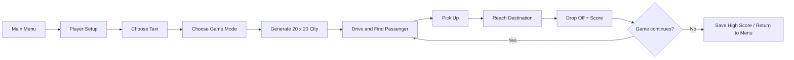

<div align="center">

# 🚕 Rush Hour — x86 Assembly

### A console-based taxi game written in 32-bit MASM using the Irvine32 library

<p>
  
  
  
  
  
</p>

Drive a taxi through a generated city grid, pick up passengers, reach their destinations, avoid traffic and obstacles, collect bonuses, and push your score as high as possible.

</div>

---

## 🎮 Gameplay

Rush Hour is a text-mode driving game built directly in x86 assembly. The city is represented as a **20 × 20 grid**, with roads, buildings, passengers, destinations, obstacles, moving cars, and collectible bonus items drawn in the Windows console.

You choose a taxi, select a game mode, and then navigate the city one tile at a time while managing score, fuel, traffic, and deliveries.

### 🚖 Taxi Choices

The game supports two taxi styles with different trade-offs:

| Taxi | Play Style | Obstacle Penalty | Car Collision Penalty |
|---|---|---:|---:|
| **Yellow** | Faster movement | `-4` | `-2` |
| **Red** | Slower but tougher | `-2` | `-3` |

A third selection option chooses the taxi colour randomly.

### 🕹️ Game Modes

| Mode | Goal |
|---|---|
| **Career** | Complete deliveries while managing a limited fuel supply |
| **Time** | Score as much as possible within **120 seconds** |
| **Endless** | Keep playing while the game progressively increases the difficulty |

### 🎚️ Difficulty Levels

| Difficulty | Starting Fuel | Obstacles | Traffic Speed |
|---|---:|---:|---|
| **Easy** | `1000` | `5` | Slow |
| **Medium** | `500` | `7` | Normal |
| **Hard** | `300` | `10` | Fast |

### 🎯 Core Objective

- Move through the road network using `W`, `A`, `S`, and `D`
- Pick up a nearby passenger with `Space`
- Drive to the passenger's green destination
- Drop the passenger off for **+10 points**
- Collect bonus items for additional score
- Avoid buildings, obstacles, passengers, and moving traffic
- Keep an eye on fuel in Career and Time modes
- Build a high score and place on the **Top 10 leaderboard**

### 🔄 Game Flow



### 🎮 Controls

| Key | Action |
|---|---|
| `W` | Move up |
| `A` | Move left |
| `S` | Move down |
| `D` | Move right |
| `Space` | Pick up / drop off a passenger |
| `P` | Pause / resume |
| `L` | Save the current game |
| `X` | Exit the current session / return to menu where supported |

---

## 🧠 How the Game Works

The entire game is implemented in a single MASM source file, `proj.asm`. Instead of relying on a game engine, the project manages the board, entity positions, input, rendering, timing, file I/O, and game state directly through assembly procedures and Irvine32 routines.

### 🗺️ Board Generation

The board is stored as a **400-byte array**, representing a 20 × 20 grid.

At the beginning of a new game, the program:

- initializes the grid as road tiles
- randomly places building cells
- keeps `(0, 0)` available as the player start position
- guarantees road corridors along every fifth row and column
- generates passengers and destinations on usable road positions
- places obstacles according to the selected difficulty
- spawns NPC traffic cars
- adds collectible bonus items

This gives the map some randomness while retaining a predictable road structure that the player can navigate.

### 🚕 Passenger Pickup & Drop-off

The game can track up to **five passengers** at once. Each passenger has separate arrays for:

- current `X` / `Y` position
- destination `X` / `Y` position
- picked-up state
- active state

A passenger can be picked up when the taxi is close enough. While carrying one, the game stores that passenger's index and waits until the player reaches the matching destination tile.

A successful drop-off adds **10 points**, respawns passengers when needed, and can also increase traffic difficulty as the run continues.

### 🚗 Moving Traffic

NPC cars keep their own position and direction data in parallel arrays.

Each update moves active traffic along road cells. If a car reaches an invalid path or boundary, its direction is reversed. The game starts with five traffic cars and can spawn additional cars up to the configured maximum of eight.

### 📈 Dynamic Difficulty

Difficulty changes during play as well as through the main difficulty setting.

After every **two completed drop-offs**, the normal game loop can:

- increase NPC movement speed
- add another traffic car when space is available

Endless Mode has additional progression logic. At delivery milestones, it can increase traffic speed, add obstacles, and add more cars until the configured limits are reached.

### 💎 Bonuses

Between **three and five bonus items** are initially placed on road cells. Bonus items are tracked separately from passengers and traffic, and collecting one adds score while triggering the bonus sound effect when the corresponding audio file is available.

The game also maintains the number of active bonus items so new ones can be spawned when the count becomes low.

### ⛽ Fuel

Movement consumes fuel in Career and Time modes.

The starting amount depends on difficulty:

- Easy — `1000`
- Medium — `500`
- Hard — `300`

Endless Mode bypasses normal fuel pressure so the session can continue while difficulty rises.

### 💾 Save & Continue

Pressing `L` during supported gameplay saves the current state to `savegame.txt`.

The save data includes more than just the score. The program writes information such as:

- player position
- score and fuel
- taxi colour
- current passenger state
- completed deliveries
- difficulty
- board contents
- obstacles
- NPC traffic positions and directions
- bonus-item state

The **Continue Game** option restores this data on the next load.

### 🏆 Leaderboard

The game maintains a **Top 10 high-score table** in `highscores.txt`.

Player names and scores are loaded when the program starts, updated after eligible game sessions, sorted into leaderboard order, and written back to disk for later runs.

---

## 📊 Implementation & Complexity

Most structures in the game have intentionally small fixed limits, so many operations are bounded in practice. The complexity table below describes how the routines scale conceptually if those limits were treated as variables.

| Operation | Approx. Complexity |
|---|---:|
| Draw the board | `O(R × C)` |
| Search for an available road position | `O(T × E)` worst case |
| Occupancy / collision scan | `O(P + O + C + B)` |
| Passenger pickup search | `O(P)` |
| Update NPC traffic | `O(C)` |
| Maintain passenger / bonus entities | `O(P)` / `O(B)` plus spawn attempts |
| Insert/update leaderboard | `O(H)` |
| Save or load game state | `O(R × C + P + O + C + B)` |

Where:

- `R × C` — board dimensions (`20 × 20` in the current game)
- `T` — maximum random placement attempts
- `E` — entity checks needed to validate a position
- `P` — passengers, capped at `5`
- `O` — obstacles, capped at `10`
- `C` — NPC cars, capped at `8`
- `B` — bonus items, capped at `5`
- `H` — leaderboard entries, capped at `10`

Because the board and entity limits are fixed, these operations remain small during normal gameplay.

---

## 🛠️ Tech Stack

| Technology | Role in the Project |
|---|---|
| **x86 Assembly** | Complete game logic and state management |
| **MASM** | Microsoft Macro Assembler used to assemble the source |
| **Irvine32** | Console I/O, random numbers, delays, file handling, colours, and utility routines |
| **WinMM / PlaySound** | Windows sound playback |
| **Windows Console** | Text-based rendering and keyboard-driven gameplay |

---

## 🚀 Getting Started

This project targets **32-bit x86 Windows** and uses `Irvine32.inc`, so it should be built with the 32-bit MASM/Irvine32 toolchain rather than as an x64 assembly project.

### 1 — Clone the Repository

```powershell
git clone https://github.com/fizzahussain/RUSH-HOUR_assembly.git
cd RUSH-HOUR_assembly
```

### 2 — Install Visual Studio with MASM Support

Install Visual Studio with the **Desktop development with C++** workload. MASM is included with the Visual C++ toolchain.

### 3 — Set Up Irvine32

Download and configure the Irvine32 libraries, then use a **32-bit assembly project**. The official Irvine materials provide preconfigured Visual Studio project templates for this setup.

Official setup guide:

- [Irvine32 / MASM setup for Visual Studio](https://asmirvine.com/gettingStartedVS2026/index.htm)

### 4 — Add the Source File

Add `proj.asm` to the 32-bit Irvine/MASM project and make sure the project can resolve:

```asm
INCLUDE Irvine32.inc
includelib winmm.lib
```

Build for **x86 / Win32**, not x64.

### 5 — Build and Run

Build the project from Visual Studio and run the generated executable from the debugger or project output directory.

> [!IMPORTANT]
> The source references `start.wav`, `collision.wav`, `pickup.wav`, `bonus_collect.wav`, `gameover.wav`, and `pause.wav`. These audio files are **not included in the current repository**, so sound playback requires you to provide those files in the program's working directory.

Runtime files such as `savegame.txt` and `highscores.txt` are created by the game as needed.

---

## 📁 Project Structure

```text
RUSH-HOUR_assembly/
├── proj.asm              # Complete game implementation
├── .gitattributes        # Repository text/attribute configuration
├── README.md             # Project overview and setup guide
└── docs/
    └── TECHNICAL.md      # Deeper implementation notes
```

The original project is intentionally compact: the complete game logic lives in `proj.asm`.

---

## 🔍 Technical Documentation

For a procedure-level walkthrough of the board representation, random spawning, traffic updates, collision checks, save/load format, game modes, and leaderboard handling, see:

**[`docs/TECHNICAL.md`](docs/TECHNICAL.md)**

---

## 📌 Project Background

Rush Hour was built as an assembly-language project to implement a complete interactive game without a high-level framework. It brings together low-level state management, arrays and memory addressing, procedures, loops, branching, file operations, console rendering, keyboard input, timing, randomization, and Windows multimedia calls in one program.
